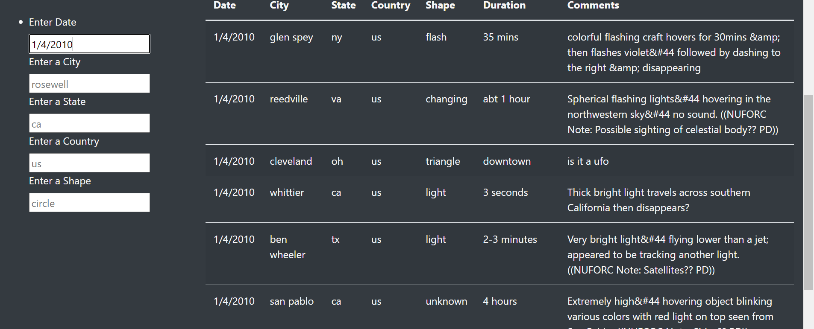

# UFOs

## Overview of Project

### Purpose
The purpose of this analysis is to:
1. Filter out UFO sightings data based on couple of search criterias at the same time.  
2. Make it easier for the user to read the data in which they are interested rather than browing the whole data. 

## Results

### Walk through the search criteria. 
1. The new web page provides user the flexiblity to filter out data in which they are interested. 
2. There are various criterias on which user can filter. 

3. User can either filter out data on one criteria or multiple criterias. 
   Following image shows filtered data on just *date* : *1/4/2010*

4. Following image shows filtered data on *data* and *state* both. 
   Date is *1/4/2010* and State is *Texas*

5. By default the web page shows the full data. 
6. *Placeholders*(faded text in text box) helps user by giving idea what kind of data can be the input. 

## Summary

### Drawback
1. User has to type inside the search box for whatever criteria it is looking for. 

### Recommendations
1. Instead of text box, drop down should be there for each filter criteria to give list of available options. 
   Eg : In *Enter a state* box, there should be drop down of ar, ca, or, etc. 
2. Text box can have autocomplete for each filter. 